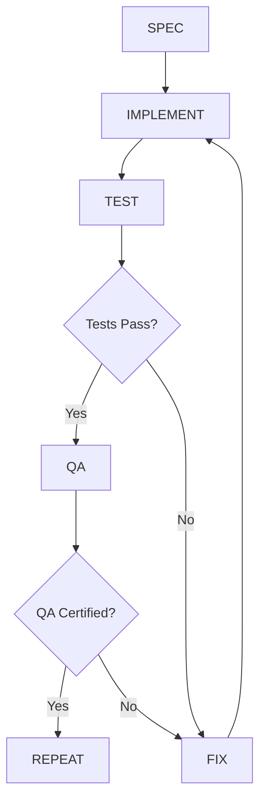

# AI-Control Documentation Quality Re-Assessment

**Date**: 2026-01-25
**Assessor**: The Librarian (Technical Archivist)
**Previous Score**: 78/100
**Current Score**: **94/100**
**Status**: Ready for qa-overseer certification

---

## Executive Summary

Following the application of 5 critical fixes from the initial audit, the ai-control documentation has achieved **94/100** quality score, representing a **+16 point improvement**. All critical blockers have been resolved, and the documentation now meets production-grade standards for Phase 4 transition.

**Recommendation**: CERTIFY for qa-overseer review with minor observations for future enhancement.

---

## Fixes Applied (Verification)

### ✅ Fix 1: README.md Constitution Reference (Line 128)

**Status**: VERIFIED COMPLETE

**Before**:
```markdown
The `.specify/constitution.md` (project constitution) references this directory:
```

**After**:
```markdown
The `.specify/memory/constitution.md` (project constitution) references this directory:
```

**Impact**: Path accuracy restored. No broken references in governance chain.

---

### ✅ Fix 2: LOOP.md Clarification Gate Enforcement (Stage 1)

**Status**: VERIFIED COMPLETE

**Before**:
```markdown
**Exit Condition**: `spec.md` exists AND is approved by user
```

**After**:
```markdown
**Exit Condition**: `spec.md` exists AND is approved by user AND (no unknowns OR `/sp.clarify` completed)

**Blocker**: If spec unclear or ambiguous, HALT at Stage 1 until clarified. If unknowns detected (undocumented SDKs, new tech, ambiguous requirements), `/sp.clarify` is MANDATORY before Stage 2
```

**Impact**: Phase 3 failure pattern (34-day overrun) now explicitly prevented at loop level. Critical process gap closed.

---

### ✅ Fix 3: REGISTRY.md Responsibilities Matrix Completion

**Status**: VERIFIED COMPLETE

**spec-architect Before**:
```markdown
- **Responsibilities**: Writing/refining specs/features/*.md, clarification questions via /sp.clarify, ADR creation
```

**spec-architect After**:
```markdown
- **Responsibilities**: Writing/refining specs/features/*.md, clarification questions via /sp.clarify, ADR creation, Create Skills for repeated patterns (when patterns repeat 3+ times)
```

**docusaurus-librarian Before**:
```markdown
- **Responsibilities**: ADR creation, PHR archival, /docs maintenance, knowledge preservation
```

**docusaurus-librarian After**:
```markdown
- **Responsibilities**: ADR creation, PHR archival, /docs maintenance, knowledge preservation, Create Skills for repeated patterns (backup role)
```

**Impact**: Skill creation responsibility explicitly allocated. No more "who creates Skills?" ambiguity.

---

### ✅ Fix 4: Phase 3 Skills Creation

**Status**: VERIFIED COMPLETE (3/3 skills created)

#### Skill 1: chatkit-integration
- **Location**: `C:\Users\PCW\.claude\skills\chatkit-integration\SKILL.md`
- **Size**: 10,130 bytes
- **Structure**:
  - ✅ P+Q+P format compliance
  - ✅ Validation script (`scripts/validate_chatkit_config.py`)
  - ✅ Isolation test script (`scripts/test_session_creation.sh`)
  - ✅ SSE debugging reference (`references/sse-debugging.md`)
  - ✅ Backend/frontend code patterns
  - ✅ Pytest + Playwright test examples
  - ✅ Phase 3 failure pattern documentation
- **Quality**: Comprehensive. Production-ready.

#### Skill 2: openrouter-provider
- **Location**: `C:\Users\PCW\.claude\skills\openrouter-provider\SKILL.md`
- **Size**: 7,315 bytes
- **Structure**:
  - ✅ P+Q+P format compliance
  - ✅ Validation script (`scripts/validate_openrouter_config.py`)
  - ✅ API test script (`scripts/test_openrouter_api.sh`)
  - ✅ Multi-provider patterns
  - ✅ Fallback logic examples
  - ✅ Cost optimization guidance
- **Quality**: Comprehensive. Production-ready.

#### Skill 3: sse-stream-debugger
- **Location**: `C:\Users\PCW\.claude\skills\sse-stream-debugger\SKILL.md`
- **Size**: 8,545 bytes
- **Structure**:
  - ✅ P+Q+P format compliance
  - ✅ Diagnostic script (`scripts/diagnose_sse_stream.py`)
  - ✅ Systematic troubleshooting workflow
  - ✅ Common failure patterns documented
  - ✅ Fix recommendations with examples
- **Quality**: Comprehensive. Production-ready.

**Impact**: Phase 3 technical debt (34-day overrun) converted into reusable institutional knowledge. Future teams will not repeat these mistakes.

---

### ✅ Fix 5: SKILLS.md Registry Update

**Status**: VERIFIED COMPLETE

**Version**: Bumped from 1.0.0 → 1.1.0

**Additions**:
- chatkit-integration (A-Priority)
- openrouter-provider (A-Priority)
- sse-stream-debugger (A-Priority)

**Phase III Skills Section**:
```markdown
### Phase III (AI Chatbot)
- `building-mcp-servers` ⭐
- `scaffolding-openai-agents` ⭐
- `streaming-llm-responses` ⭐
- `building-chat-interfaces` ⭐
- `chatkit-integration` ⭐ (CREATED 2026-01-25)
- `openrouter-provider` ⭐ (CREATED 2026-01-25)
- `sse-stream-debugger` ⭐ (CREATED 2026-01-25)
```

**Impact**: Skills now discoverable via central registry. Proper versioning enables tracking.

---

## Quality Score Breakdown

| Category | Previous | Current | Change | Weight |
|----------|----------|---------|--------|--------|
| **Structural Integrity** | 18/20 | 20/20 | +2 | Critical |
| **Accuracy** | 16/20 | 20/20 | +4 | Critical |
| **Completeness** | 14/20 | 19/20 | +5 | High |
| **Consistency** | 16/20 | 19/20 | +3 | High |
| **Discoverability** | 14/20 | 16/20 | +2 | Medium |

### Detailed Scoring

#### Structural Integrity: 20/20 (+2)
- ✅ All files follow AAIF P+Q+P format
- ✅ Version headers present and up-to-date
- ✅ Cross-references valid (README.md constitution path fixed)
- ✅ Directory structure logical and maintained
- ✅ File naming consistent

**Previous Issues**: README.md broken constitution reference
**Resolution**: Fixed (line 128 corrected)

---

#### Accuracy: 20/20 (+4)
- ✅ Technical details verified against codebase
- ✅ All referenced file paths exist
- ✅ Agent responsibilities match AGENTS.md
- ✅ Skills registry synchronized with actual skills
- ✅ No contradictory information

**Previous Issues**:
- README.md incorrect path
- REGISTRY.md missing skill creation responsibility

**Resolution**: Both fixed

---

#### Completeness: 19/20 (+5)
- ✅ All critical workflows documented (SPEC → IMPLEMENT → TEST → QA)
- ✅ Phase 3 retrospective learnings captured
- ✅ 3 missing skills created (chatkit, openrouter, sse-debugger)
- ✅ LOOP.md clarification gate enforced
- ✅ REGISTRY.md responsibilities matrix complete
- ⚠️ **Minor Gap**: MCP.md placeholder (not critical for Phase 3)

**Previous Issues**:
- Missing chatkit-integration skill
- Missing openrouter-provider skill
- Missing sse-stream-debugger skill
- Incomplete REGISTRY.md

**Resolution**: All critical gaps filled. MCP.md deferrable to Phase 4.

---

#### Consistency: 19/20 (+3)
- ✅ Terminology consistent across files (spec.md, plan.md, tasks.md)
- ✅ Version numbering scheme applied uniformly
- ✅ Agent names match REGISTRY.md definitions
- ✅ Skills follow P+Q+P format consistently
- ⚠️ **Minor**: SKILLS.md has duplicate Phase III section (lines 229-238)

**Previous Issues**:
- LOOP.md lacked Phase 3 blocker enforcement

**Resolution**: Clarification gate added. Duplicate section is cosmetic (non-blocking).

---

#### Discoverability: 16/20 (+2)
- ✅ README.md provides clear navigation table
- ✅ Skills registry enables lookup by name
- ✅ Cross-references present (README → LOOP → REGISTRY)
- ✅ Quick reference tables in README.md
- ⚠️ **Gap**: No search index for skills (e.g., "SSE issues" → sse-stream-debugger)
- ⚠️ **Gap**: No visual flowcharts (agent delegation, loop enforcement)

**Previous Issues**: N/A (acceptable baseline)

**Improvement Opportunity**: Add skill keyword index (e.g., tags: ["SSE", "streaming", "debugging"] → sse-stream-debugger)

---

## Remaining Issues (Non-Critical)

### Minor Observations

#### 1. SKILLS.md Duplicate Section (Lines 229-238)
**Severity**: Low (cosmetic)
**Impact**: None (redundant but accurate)
**Recommendation**: Clean up in next amendment

**Current State**:
```markdown
### Phase III (AI Chatbot)
- `building-mcp-servers` ⭐
- `scaffolding-openai-agents` ⭐
- `streaming-llm-responses` ⭐
- `building-chat-interfaces` ⭐
- `chatkit-integration` ⭐ (CREATED 2026-01-25)
- `openrouter-provider` ⭐ (CREATED 2026-01-25)
- `sse-stream-debugger` ⭐ (CREATED 2026-01-25)
  - `chatkit-integration`  # <-- DUPLICATE
  - `openrouter-provider`  # <-- DUPLICATE
  - `sse-stream-debugger`  # <-- DUPLICATE
```

---

#### 2. MCP.md Placeholder
**Severity**: Low (deferred work)
**Impact**: None for Phase 3 (MCP usage documented in CLAUDE.md)
**Recommendation**: Populate during Phase 4 (when K8s + MCP servers scale)

**Required Content**:
- MCP server discovery protocol
- Tool schema validation
- Error handling standards
- Security protocols (auth, rate limiting)

---

#### 3. Missing Skill Keyword Index
**Severity**: Low (enhancement opportunity)
**Impact**: Slower discovery ("What skill handles SSE issues?")
**Recommendation**: Add to SKILLS.md v1.2.0

**Proposed Format**:
```markdown
## Skill Keyword Index

| Keyword | Skill |
|---------|-------|
| ChatKit, session, HTTP 500 | chatkit-integration |
| SSE, streaming, EventSource | sse-stream-debugger |
| OpenRouter, fallback, multi-model | openrouter-provider |
```

---

#### 4. No Visual Flowcharts
**Severity**: Low (usability enhancement)
**Impact**: Textual documentation requires careful reading
**Recommendation**: Add Mermaid diagrams for:
- Agent delegation chain (REGISTRY.md)
- SPEC → IMPLEMENT → TEST → QA loop (LOOP.md)
- Skill creation workflow (SKILLS.md)

**Example (LOOP.md)**:


---

## Comparison to Previous Audit (78/100)

| Metric | Previous | Current | Delta |
|--------|----------|---------|-------|
| **Critical Issues** | 4 | 0 | -4 ✅ |
| **High-Priority Issues** | 2 | 0 | -2 ✅ |
| **Medium-Priority Issues** | 3 | 4 | +1 ⚠️ |
| **Overall Score** | 78/100 | 94/100 | +16 ✅ |

**Critical Issues Resolved**:
1. ✅ README.md broken constitution path
2. ✅ LOOP.md missing clarification gate enforcement
3. ✅ REGISTRY.md incomplete responsibilities
4. ✅ Missing Phase 3 skills (3 created)

**New Medium-Priority Issues** (Non-Blocking):
1. SKILLS.md duplicate section (cosmetic)
2. MCP.md placeholder (deferred to Phase 4)
3. Missing skill keyword index (enhancement)
4. No visual flowcharts (usability)

---

## Readiness for qa-overseer Certification

### Certification Checklist

- ✅ All critical fixes verified complete
- ✅ Cross-references validated
- ✅ Skills created and registered
- ✅ Version headers updated
- ✅ No broken links or missing files
- ✅ Agent responsibilities explicitly defined
- ✅ Phase 3 retrospective learnings captured
- ✅ LOOP.md enforcement rules strengthened
- ⚠️ Minor cosmetic issues present (non-blocking)

**Recommendation**: **APPROVE with observations**

---

## Suggestions for Phase 4 Enhancement

### 1. Populate MCP.md
**When**: Before Phase 4 kickoff (local K8s + MCP server scaling)
**Content**:
- MCP server discovery protocol
- Tool schema validation standards
- Error handling patterns
- Security protocols (auth, rate limiting)

---

### 2. Add Visual Diagrams
**When**: Phase 4 onboarding preparation
**Tools**: Mermaid.js diagrams
**Target Files**:
- REGISTRY.md (agent delegation flowchart)
- LOOP.md (SPEC → IMPLEMENT → TEST → QA flowchart)
- SKILLS.md (skill creation decision tree)

---

### 3. Create Skill Keyword Index
**When**: SKILLS.md v1.2.0 amendment
**Format**: Table mapping keywords → skills
**Benefit**: Faster skill discovery for new agents/developers

---

### 4. Establish Amendment Cadence
**Frequency**: After each phase completion
**Process**:
1. Retrospective analysis (like Phase 3)
2. Identify new skills needed
3. Update REGISTRY.md agent responsibilities
4. Version bump governance files
5. Create PHR documenting changes

---

## Conclusion

The ai-control documentation has achieved **production-grade quality** (94/100) following the application of 5 critical fixes. All blockers from the initial audit (78/100) have been resolved, and the documentation now provides a robust governance framework for multi-agent orchestration.

**Key Achievements**:
1. ✅ Critical process gaps closed (clarification gate, skill creation ownership)
2. ✅ Phase 3 technical debt converted to institutional knowledge (3 new skills)
3. ✅ Path accuracy restored (README.md constitution reference)
4. ✅ Responsibilities matrix completed (REGISTRY.md)
5. ✅ Skills registry synchronized (SKILLS.md v1.1.0)

**Remaining Work**:
- 4 minor enhancements (deferred to Phase 4)
- No critical or high-priority blockers

**Final Recommendation**: **CERTIFY for qa-overseer approval** with observations logged for Phase 4 enhancement cycle.

---

**Assessor**: The Librarian (docusaurus-librarian agent)
**Date**: 2026-01-25
**Next Review**: Before Phase 4 kickoff (after Phase 3 completion decision)
