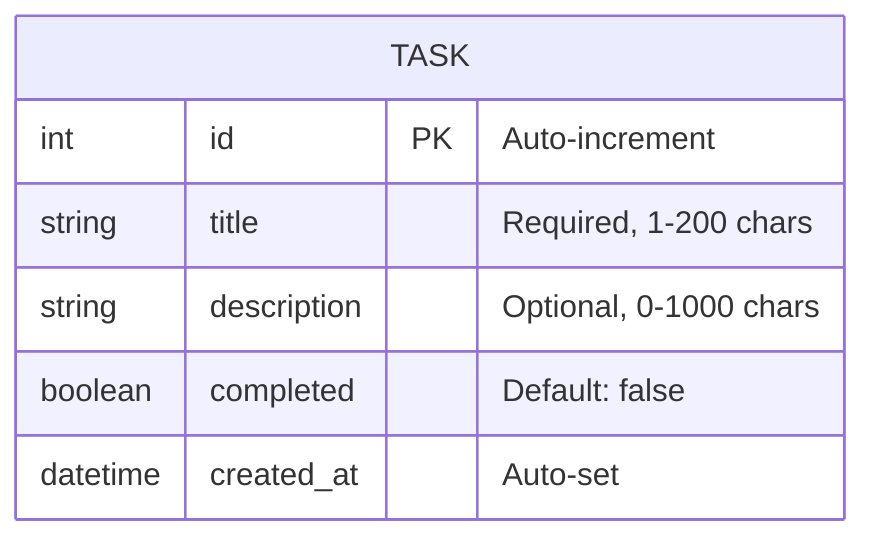

# Data Model: Phase I Core CRUD

**Feature**: 001-core-crud
**Date**: 2025-12-27
**Source**: `specs/001-core-crud/spec.md` Key Entities section

---

## Entities

### Task

Represents a single todo item in the application.

```python
@dataclass
class Task:
    id: int                    # Auto-generated sequential integer (1, 2, 3, ...)
    title: str                 # Required, 1-200 characters
    description: str           # Optional, 0-1000 characters, default ""
    completed: bool            # Default: False
    created_at: datetime       # Auto-set on creation
```

#### Field Specifications

| Field | Type | Required | Default | Constraints |
|-------|------|----------|---------|-------------|
| `id` | `int` | Auto | N/A | Sequential starting from 1; unique |
| `title` | `str` | Yes | N/A | 1-200 chars; cannot be empty |
| `description` | `str` | No | `""` | 0-1000 chars |
| `completed` | `bool` | No | `False` | Toggle via mark_complete |
| `created_at` | `datetime` | Auto | `datetime.now()` | Immutable after creation |

#### Validation Rules

| Rule | Field(s) | Error Message |
|------|----------|---------------|
| Title required | `title` | "Title cannot be empty" |
| Title length | `title` | Truncate at 200 chars with warning |
| Description length | `description` | Truncate at 1000 chars silently |
| ID format | input | "Please enter a valid numeric ID" |
| ID exists | `id` | "Task with ID {id} not found" |

---

## State Transitions

```
                    ┌──────────────┐
                    │   CREATED    │
                    │  (pending)   │
                    └──────┬───────┘
                           │ mark_complete(id)
                           ▼
                    ┌──────────────┐
                    │  COMPLETED   │
                    │  (completed) │
                    └──────┬───────┘
                           │ toggle (mark_complete again)
                           ▼
                    ┌──────────────┐
                    │   PENDING    │
                    │  (pending)   │
                    └──────────────┘
```

**Valid Transitions**:
- `pending` → `completed` (via `mark_complete`)
- `completed` → `pending` (via `mark_complete` toggle)

---

## Storage Schema

### In-Memory (Phase I)

```python
# TodoRepository internal storage
_tasks: dict[int, Task] = {}
_next_id: int = 1
```

**Operations**:
| Operation | Method | Description |
|-----------|--------|-------------|
| Create | `add(task)` | Store task, increment `_next_id` |
| Read All | `get_all()` | Return `list(_tasks.values())` |
| Read One | `get_by_id(id)` | Return `_tasks.get(id)` or `None` |
| Update | `update(task)` | Replace `_tasks[task.id]` |
| Delete | `delete(id)` | Remove `_tasks[id]` |

---

## Relationships

Phase I has no relationships (single entity model).

**Future Phases**:
- Phase II: `Task` → `User` (many-to-one)
- Phase V: `Task` → `Category` (many-to-many via tags)

---

## Migration Path to Phase II

| Phase I (In-Memory) | Phase II (SQLModel) |
|---------------------|---------------------|
| `@dataclass Task` | `class Task(SQLModel, table=True)` |
| `id: int` | `id: int \| None = Field(primary_key=True)` |
| `dict[int, Task]` | `session.query(Task)` |
| `TodoRepository` | `TodoRepository` (swap storage) |
| `TodoService` | `TodoService` (unchanged logic) |

The Service-Repository pattern ensures Phase II migration only requires:
1. Convert `Task` dataclass to `SQLModel`
2. Replace `MemoryRepository` with `SQLModelRepository`
3. Service layer remains unchanged

---

## Entity Diagram



---

## Sample Data

```python
# Example tasks in memory
{
    1: Task(id=1, title="Buy groceries", description="", completed=False, created_at=datetime(2025, 12, 27, 10, 0, 0)),
    2: Task(id=2, title="Call mom", description="Wish her happy birthday", completed=True, created_at=datetime(2025, 12, 27, 10, 5, 0)),
    3: Task(id=3, title="Finish hackathon", description="Phase I due Dec 7", completed=False, created_at=datetime(2025, 12, 27, 10, 10, 0))
}
```
