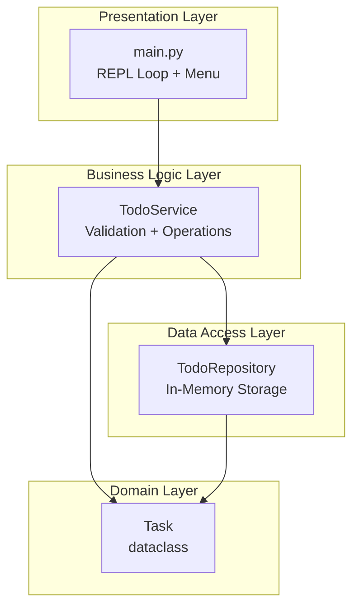
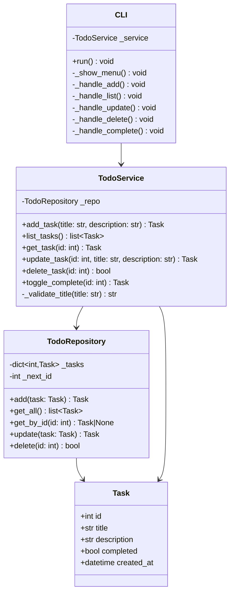
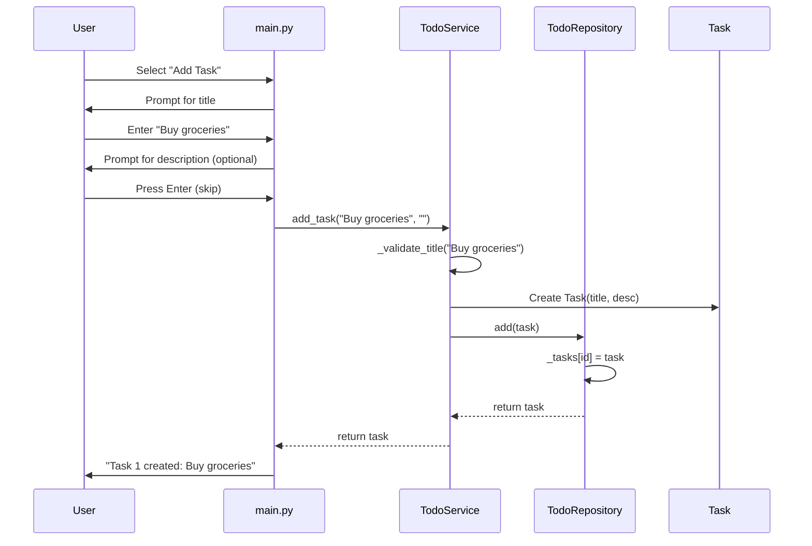

# Implementation Plan: Phase I Core CRUD Console App

**Branch**: `001-core-crud` | **Date**: 2025-12-27 | **Spec**: [spec.md](./spec.md)
**Input**: Feature specification from `/specs/001-core-crud/spec.md`

---

## Summary

Build an in-memory Python console application implementing 5 core CRUD operations (Add, View, Update, Delete, Mark Complete) using a Service-Repository pattern to facilitate future evolution to Phase II web application.

**Key Approach**:
- Interactive REPL loop with menu-driven navigation
- Layered architecture: CLI → Service → Repository → In-Memory Storage
- No external dependencies beyond Python standard library (except pytest for testing)
- Data is NOT persistent (lost on application exit)

---

## Technical Context

**Language/Version**: Python 3.13+
**Primary Dependencies**: Python standard library only (dataclasses, datetime)
**Storage**: In-Memory dictionary (`dict[int, Task]`)
**Testing**: pytest
**Target Platform**: Console/Terminal (Windows, macOS, Linux)
**Project Type**: Single project (console application)
**Performance Goals**: All operations < 100ms (instant for in-memory)
**Constraints**: No file persistence, no external deps, single-user
**Scale/Scope**: Single user, ~100s of tasks per session

---

## Constitution Check

*GATE: Must pass before implementation. All gates PASSED.*

| Gate | Status | Evidence |
|------|--------|----------|
| Spec-Driven Development | PASS | Plan derived from approved spec.md |
| Iterative Evolution | PASS | Service-Repository pattern supports Phase II migration |
| Test-First Mindset | PASS | pytest tests planned for Service layer |
| Smallest Viable Diff | PASS | Only essential components, no extras |
| Intelligence Capture | PASS | PHR will be created after planning |

---

## Architecture Design

### Component Diagram



### Class Diagram



### Sequence Diagram: Add Task



---

## Project Structure

### Documentation (this feature)

```text
specs/001-core-crud/
├── spec.md              # Feature specification
├── plan.md              # This file
├── research.md          # Technology decisions
├── data-model.md        # Entity definitions
├── quickstart.md        # Developer setup guide
└── tasks.md             # Implementation tasks (from /sp.tasks)
```

### Source Code (repository root)

```text
src/
├── __init__.py
├── main.py                 # Entry point + REPL loop
├── models/
│   ├── __init__.py
│   └── task.py             # Task dataclass
├── repositories/
│   ├── __init__.py
│   └── memory_repo.py      # In-memory dict storage
└── services/
    ├── __init__.py
    └── todo_service.py     # Business logic + validation

tests/
├── __init__.py
├── conftest.py             # pytest fixtures
├── unit/
│   ├── __init__.py
│   ├── test_task.py        # Task model tests
│   ├── test_repository.py  # Repository tests
│   └── test_service.py     # Service tests
└── integration/
    ├── __init__.py
    └── test_todo_flow.py   # End-to-end service tests
```

**Structure Decision**: Single project with layered architecture (`src/` with models, repositories, services). Chosen to support Service-Repository pattern and Phase II migration.

---

## Component Specifications

### 1. Task Model (`src/models/task.py`)

```python
from dataclasses import dataclass, field
from datetime import datetime

@dataclass
class Task:
    id: int
    title: str
    description: str = ""
    completed: bool = False
    created_at: datetime = field(default_factory=datetime.now)
```

**Responsibilities**:
- Represent a todo item with all required fields
- Provide default values for optional fields
- Auto-generate `__init__`, `__repr__`, `__eq__`

---

### 2. TodoRepository (`src/repositories/memory_repo.py`)

```python
class TodoRepository:
    def __init__(self):
        self._tasks: dict[int, Task] = {}
        self._next_id: int = 1

    def add(self, task: Task) -> Task: ...
    def get_all(self) -> list[Task]: ...
    def get_by_id(self, task_id: int) -> Task | None: ...
    def update(self, task: Task) -> Task: ...
    def delete(self, task_id: int) -> bool: ...
```

**Responsibilities**:
- Manage in-memory task storage
- Generate sequential IDs
- Provide CRUD operations on storage
- NO validation logic (delegated to Service)

---

### 3. TodoService (`src/services/todo_service.py`)

```python
class TodoService:
    def __init__(self, repository: TodoRepository):
        self._repo = repository

    def add_task(self, title: str, description: str = "") -> Task: ...
    def list_tasks(self) -> list[Task]: ...
    def get_task(self, task_id: int) -> Task: ...
    def update_task(self, task_id: int, title: str | None, description: str | None) -> Task: ...
    def delete_task(self, task_id: int) -> bool: ...
    def toggle_complete(self, task_id: int) -> Task: ...

    def _validate_title(self, title: str) -> str: ...
```

**Responsibilities**:
- Validate inputs (title not empty, title length)
- Orchestrate business operations
- Raise appropriate errors for invalid operations
- Call Repository for storage operations

**Error Handling**:
| Error | Raised When | Message |
|-------|-------------|---------|
| `ValueError` | Empty title | "Title cannot be empty" |
| `KeyError` | Task not found | "Task with ID {id} not found" |

---

### 4. CLI (`src/main.py`)

```python
def main():
    service = TodoService(TodoRepository())
    while True:
        show_menu()
        choice = input("Enter choice: ")
        if choice == "1": handle_add(service)
        elif choice == "2": handle_list(service)
        elif choice == "3": handle_update(service)
        elif choice == "4": handle_delete(service)
        elif choice == "5": handle_complete(service)
        elif choice == "6": break
        else: print("Invalid choice")
    print("Goodbye!")
```

**Menu Structure**:
```
=== Todo App ===
1. Add Task
2. View All Tasks
3. Update Task
4. Delete Task
5. Mark Complete/Incomplete
6. Exit
================
Enter choice:
```

**Responsibilities**:
- Display menu and accept user input
- Parse and validate input format
- Call Service methods
- Display results and error messages
- Handle graceful exit

---

## Testing Strategy

### Unit Tests

| Component | Test File | Tests |
|-----------|-----------|-------|
| Task | `test_task.py` | Creation, defaults, equality |
| Repository | `test_repository.py` | CRUD operations, ID generation |
| Service | `test_service.py` | Validation, business logic, errors |

### Integration Tests

| Test | Description |
|------|-------------|
| `test_add_and_list` | Add tasks, verify they appear in list |
| `test_complete_toggle` | Toggle completion status |
| `test_update_task` | Update title and description |
| `test_delete_task` | Delete and verify removal |
| `test_error_handling` | Invalid IDs, empty titles |

### Manual Verification

Based on spec acceptance scenarios:
- [ ] Add task with title only
- [ ] Add task with title and description
- [ ] View empty list message
- [ ] View tasks with status indicators
- [ ] Mark task as complete
- [ ] Toggle back to pending
- [ ] Update task title
- [ ] Update task description
- [ ] Delete existing task
- [ ] Error on non-existent ID

---

## Data Volatility Notice

**IMPORTANT**: This is Phase I with in-memory storage.

- All data is stored in a Python dictionary
- Data is **NOT** persisted to disk
- Data is **LOST** when the application exits
- This is **EXPECTED BEHAVIOR** per the specification

Phase II will introduce database persistence via SQLModel and Neon PostgreSQL.

---

## Complexity Tracking

No constitution violations detected. Structure is minimal and justified:

| Component | Justification |
|-----------|---------------|
| Service-Repository pattern | Required for Phase II evolution (user request) |
| Separate models directory | Clean separation, easy to convert to SQLModel |
| REPL loop | Clarified requirement from /sp.clarify |

---

## Next Steps

1. Run `/sp.tasks` to generate implementation task breakdown
2. Execute tasks in dependency order
3. Run pytest to verify implementation
4. Manual verification of acceptance scenarios
5. Create demo video for hackathon submission

---

**Plan Status**: Complete | **Ready for**: `/sp.tasks`
