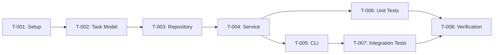

# Implementation Tasks: Phase I Core CRUD Console App

**Branch**: `001-core-crud`
**Date**: 2025-12-27
**Plan**: [plan.md](./plan.md)
**Spec**: [spec.md](./spec.md)

---

## ADR Compliance Matrix

All tasks validated against frozen Architecture Decision Records:

| ADR | Constraint | Enforcement |
|-----|------------|-------------|
| [ADR-001](../../history/adr/ADR-001-service-repository-pattern.md) | Service-Repository Pattern | Tasks follow Model → Repository → Service → CLI layering |
| [ADR-002](../../history/adr/ADR-002-cli-standard-library-repl.md) | Python stdlib only for CLI | T-005 uses `input()` + REPL loop, no typer/click |
| [ADR-003](../../history/adr/ADR-003-volatile-in-memory-persistence.md) | No file I/O persistence | NO tasks create JSON, CSV, pickle, or SQLite |

**Compliance Status**: ALL TASKS PASS

---

## Task Summary

| ID | Task | Status | Dependencies | ADR Compliance | Est. Lines |
|----|------|--------|--------------|----------------|------------|
| T-001 | Setup Project Structure | Complete | None | ADR-001 | 10 |
| T-002 | Implement Task Model | Complete | T-001 | ADR-001, ADR-003 | 20 |
| T-003 | Implement TodoRepository | Complete | T-002 | ADR-001, ADR-003 | 50 |
| T-004 | Implement TodoService | Complete | T-003 | ADR-001 | 80 |
| T-005 | Implement CLI REPL | Complete | T-004 | ADR-002 | 100 |
| T-006 | Write Unit Tests | Complete | T-004 | ADR-001 | 120 |
| T-007 | Write Integration Tests | Complete | T-005 | ALL | 60 |
| T-008 | Manual Verification | Complete | T-007 | ALL | 0 |

---

## Dependency Graph



---

## Task Details

### T-001: Setup Project Structure

**Status**: Pending
**Dependencies**: None
**Spec Reference**: Technical Constraints > Project Structure
**ADR Compliance**: ADR-001 (layered directories)

**Description**:
Initialize the Python project structure with uv and create all necessary directories and `__init__.py` files.

**Acceptance Criteria**:
- [ ] `pyproject.toml` exists with Python 3.13+ requirement
- [ ] `src/` directory with models, repositories, services subdirectories
- [ ] `tests/` directory with unit, integration subdirectories
- [ ] All `__init__.py` files created
- [ ] `uv add pytest --dev` executed successfully

**Files to Create**:
```
pyproject.toml
src/__init__.py
src/models/__init__.py
src/repositories/__init__.py
src/services/__init__.py
tests/__init__.py
tests/conftest.py
tests/unit/__init__.py
tests/integration/__init__.py
```

**Verification Step**:
```bash
# Verify structure exists
ls -la src/models/ src/repositories/ src/services/ tests/unit/ tests/integration/

# Verify uv project
uv run python -c "print('Project initialized successfully')"
```

**ADR-003 Guard**: This task creates NO persistence files (JSON, CSV, SQLite, pickle).

---

### T-002: Implement Task Model

**Status**: Pending
**Dependencies**: T-001
**Spec Reference**: Key Entities > Task
**ADR Compliance**: ADR-001 (Model layer), ADR-003 (no persistence)

**Description**:
Create the Task dataclass with all required fields and proper defaults.

**Acceptance Criteria**:
- [ ] Task dataclass defined with id, title, description, completed, created_at
- [ ] Default values: description="", completed=False, created_at=datetime.now()
- [ ] Type hints for all fields
- [ ] Imports are correct (dataclasses, datetime)

**File**: `src/models/task.py`

**Code Structure**:
```python
from dataclasses import dataclass, field
from datetime import datetime

@dataclass
class Task:
    id: int
    title: str
    description: str = ""
    completed: bool = False
    created_at: datetime = field(default_factory=datetime.now)
```

**Verification Step**:
```bash
uv run python -c "
from src.models.task import Task
t = Task(id=1, title='Test')
assert t.id == 1
assert t.title == 'Test'
assert t.description == ''
assert t.completed == False
print('Task model verification PASSED')
"
```

**ADR-003 Guard**: Task model is a pure dataclass with NO file I/O methods (save, load, export).

---

### T-003: Implement TodoRepository

**Status**: Pending
**Dependencies**: T-002
**Spec Reference**: FR-003 (ID generation), FR-010 (in-memory storage)
**ADR Compliance**: ADR-001 (Repository layer), ADR-003 (dict storage only)

**Description**:
Create the in-memory repository with CRUD operations and sequential ID generation.

**Acceptance Criteria**:
- [ ] `_tasks: dict[int, Task]` internal storage
- [ ] `_next_id: int` counter starting at 1
- [ ] `add(task)` → assigns ID, stores, returns task
- [ ] `get_all()` → returns list of all tasks
- [ ] `get_by_id(id)` → returns task or None
- [ ] `update(task)` → updates task in storage
- [ ] `delete(id)` → removes task, returns True/False

**File**: `src/repositories/memory_repo.py`

**Methods**:
| Method | Input | Output | Description |
|--------|-------|--------|-------------|
| `add` | Task (without id) | Task (with id) | Assign ID and store |
| `get_all` | None | list[Task] | Return all tasks |
| `get_by_id` | int | Task \| None | Find by ID |
| `update` | Task | Task | Replace in storage |
| `delete` | int | bool | Remove from storage |

**Verification Step**:
```bash
uv run python -c "
from src.repositories.memory_repo import TodoRepository
from src.models.task import Task

repo = TodoRepository()
task = Task(id=0, title='Test')
added = repo.add(task)
assert added.id == 1, 'ID should be 1'
assert repo.get_by_id(1) is not None
assert repo.delete(1) == True
assert repo.get_by_id(1) is None
print('TodoRepository verification PASSED')
"
```

**ADR-003 Guard**: Repository uses ONLY `dict[int, Task]`. NO methods for: `save_to_file()`, `load_from_file()`, `export()`, `import()`.

---

### T-004: Implement TodoService

**Status**: Pending
**Dependencies**: T-003
**Spec Reference**: FR-001 to FR-009 (all functional requirements)
**ADR Compliance**: ADR-001 (Service layer)

**Description**:
Create the business logic layer with validation and CRUD operations.

**Acceptance Criteria**:
- [ ] Constructor accepts TodoRepository
- [ ] `add_task(title, description)` → validates title, creates task
- [ ] `list_tasks()` → returns all tasks from repository
- [ ] `get_task(id)` → returns task or raises KeyError
- [ ] `update_task(id, title, description)` → validates, updates
- [ ] `delete_task(id)` → deletes or raises KeyError
- [ ] `toggle_complete(id)` → flips completed status
- [ ] `_validate_title(title)` → raises ValueError if empty, truncates at 200

**File**: `src/services/todo_service.py`

**Error Handling**:
| Error | Condition | Message |
|-------|-----------|---------|
| ValueError | Empty title | "Title cannot be empty" |
| KeyError | Task not found | "Task with ID {id} not found" |

**Verification Step**:
```bash
uv run python -c "
from src.services.todo_service import TodoService
from src.repositories.memory_repo import TodoRepository

service = TodoService(TodoRepository())

# Test add
task = service.add_task('Buy groceries', 'Milk, eggs')
assert task.id == 1
assert task.title == 'Buy groceries'

# Test validation
try:
    service.add_task('', '')
    assert False, 'Should have raised ValueError'
except ValueError as e:
    assert 'empty' in str(e).lower()

# Test toggle
toggled = service.toggle_complete(1)
assert toggled.completed == True

print('TodoService verification PASSED')
"
```

---

### T-005: Implement CLI REPL

**Status**: Pending
**Dependencies**: T-004
**Spec Reference**: Clarifications (Interactive REPL), FR-011 (CLI)
**ADR Compliance**: ADR-002 (stdlib input/print only)

**Description**:
Create the interactive menu-driven REPL loop with all 5 operations plus exit.

**Acceptance Criteria**:
- [ ] Main loop displays menu and accepts input
- [ ] Option 1: Add Task (prompts for title, optional description)
- [ ] Option 2: View All Tasks (displays with status indicators)
- [ ] Option 3: Update Task (prompts for ID, new values)
- [ ] Option 4: Delete Task (prompts for ID)
- [ ] Option 5: Mark Complete/Incomplete (prompts for ID)
- [ ] Option 6: Exit (breaks loop, prints goodbye)
- [ ] Invalid input shows error message
- [ ] Error handling for all operations (try/except)

**File**: `src/main.py`

**Menu Format**:
```
=== Todo App ===
1. Add Task
2. View All Tasks
3. Update Task
4. Delete Task
5. Mark Complete/Incomplete
6. Exit
================
Enter choice:
```

**Task Display Format**:
```
[ ] 1. Buy groceries - Milk, eggs, bread
[x] 2. Call mom - Wish her happy birthday
```

**Verification Step**:
```bash
# Verify CLI module loads without external deps
uv run python -c "
import src.main
print('CLI module imports successfully')
# Note: Full REPL requires interactive testing (T-008)
"
```

**ADR-002 Guard**: CLI uses ONLY `input()` and `print()`. NO imports of: `typer`, `click`, `cmd`, `argparse`.
**ADR-003 Guard**: CLI has NO save/load/export menu options.

---

### T-006: Write Unit Tests

**Status**: Pending
**Dependencies**: T-004
**Spec Reference**: III. Test-First Mindset
**ADR Compliance**: ADR-001 (tests per layer)

**Description**:
Write pytest unit tests for Task model, Repository, and Service.

**Acceptance Criteria**:
- [ ] `test_task.py`: Task creation, defaults, equality
- [ ] `test_repository.py`: All CRUD operations, ID generation
- [ ] `test_service.py`: All service methods, validation errors
- [ ] All tests pass with `pytest tests/unit/ -v`

**Files**:
```
tests/unit/test_task.py
tests/unit/test_repository.py
tests/unit/test_service.py
```

**Test Cases**:

| File | Test | Description |
|------|------|-------------|
| test_task.py | test_task_creation | Create task with all fields |
| test_task.py | test_task_defaults | Verify default values |
| test_repository.py | test_add_task | Add and retrieve task |
| test_repository.py | test_id_generation | IDs increment sequentially |
| test_repository.py | test_delete_task | Delete removes from storage |
| test_service.py | test_add_task_valid | Valid title creates task |
| test_service.py | test_add_task_empty_title | Empty title raises ValueError |
| test_service.py | test_toggle_complete | Status toggles correctly |
| test_service.py | test_task_not_found | Invalid ID raises KeyError |

**Verification Step**:
```bash
uv run pytest tests/unit/ -v --tb=short
# Expected: All tests PASSED
```

---

### T-007: Write Integration Tests

**Status**: Pending
**Dependencies**: T-005
**Spec Reference**: User Stories (acceptance scenarios)
**ADR Compliance**: ALL (tests validate ADR constraints)

**Description**:
Write integration tests that exercise Service + Repository together.

**Acceptance Criteria**:
- [ ] `test_todo_flow.py`: Full CRUD workflow
- [ ] Tests verify all acceptance scenarios from spec
- [ ] All tests pass with `pytest tests/integration/ -v`

**File**: `tests/integration/test_todo_flow.py`

**Test Cases**:
| Test | Spec Reference |
|------|----------------|
| test_add_and_list | User Story 1, 2 |
| test_complete_toggle | User Story 3 |
| test_update_task | User Story 4 |
| test_delete_task | User Story 5 |
| test_error_messages | FR-009 |

**Verification Step**:
```bash
uv run pytest tests/integration/ -v --tb=short
# Expected: All tests PASSED
```

**ADR-003 Validation Test** (MUST include):
```python
def test_no_file_persistence():
    """ADR-003: Verify no file I/O occurs during operations"""
    import os
    import glob

    # Capture files before
    before = set(glob.glob("*.json") + glob.glob("*.csv") + glob.glob("*.pkl") + glob.glob("*.db"))

    # Run full CRUD cycle
    service = TodoService(TodoRepository())
    service.add_task("Test", "Description")
    service.list_tasks()
    service.toggle_complete(1)
    service.delete_task(1)

    # Verify no new files created
    after = set(glob.glob("*.json") + glob.glob("*.csv") + glob.glob("*.pkl") + glob.glob("*.db"))
    assert before == after, "ADR-003 VIOLATION: File I/O detected!"
```

---

### T-008: Manual Verification

**Status**: Pending
**Dependencies**: T-006, T-007
**Spec Reference**: SC-006 (100% acceptance scenarios pass)
**ADR Compliance**: ALL (manual validation of constraints)

**Description**:
Manually verify all acceptance scenarios from the spec work correctly in the running application.

**Acceptance Criteria**:
- [ ] Run application with `uv run python src/main.py`
- [ ] Complete verification checklist below
- [ ] All scenarios pass

**Verification Checklist** (from spec):

**Add Task (User Story 1)**:
- [ ] Add task with title "Buy groceries" → Created with ID, pending status
- [ ] Add task with title and description → Both saved
- [ ] Add task with empty title → Error "Title cannot be empty"

**View Tasks (User Story 2)**:
- [ ] View with tasks → Shows ID, title, status indicators
- [ ] View with no tasks → Shows "No tasks found"
- [ ] View mixed statuses → [x] for completed, [ ] for pending

**Mark Complete (User Story 3)**:
- [ ] Mark pending task → Status changes, confirmation shown
- [ ] Toggle completed task → Returns to pending
- [ ] Mark non-existent ID → Error "Task with ID X not found"

**Update Task (User Story 4)**:
- [ ] Update title → Title changed, confirmation shown
- [ ] Update description → Description changed
- [ ] Update with empty title → Error, task unchanged
- [ ] Update non-existent ID → Error shown

**Delete Task (User Story 5)**:
- [ ] Delete existing task → Removed, confirmation shown
- [ ] Delete non-existent ID → Error shown
- [ ] Verify deleted task not in list

**ADR-003 Verification** (Data Volatility):
- [ ] Add 3 tasks, exit application (option 6)
- [ ] Restart application with `uv run python src/main.py`
- [ ] View tasks → Shows "No tasks found" (data was NOT persisted)
- [ ] This confirms ADR-003 compliance: in-memory only

---

## Implementation Order

Execute tasks in this order for smooth development:

1. **T-001**: Setup project → Foundation
2. **T-002**: Task model → Data layer
3. **T-003**: Repository → Storage layer
4. **T-004**: Service → Logic layer
5. **T-006**: Unit tests → Verify layers
6. **T-005**: CLI → Presentation layer
7. **T-007**: Integration tests → Verify flows
8. **T-008**: Manual verification → Final validation

---

## Commit Strategy

Each task should be committed separately:

```bash
git add . && git commit -m "T-001: Setup project structure"
git add . && git commit -m "T-002: Implement Task dataclass"
git add . && git commit -m "T-003: Implement TodoRepository"
git add . && git commit -m "T-004: Implement TodoService"
git add . && git commit -m "T-006: Add unit tests"
git add . && git commit -m "T-005: Implement CLI REPL"
git add . && git commit -m "T-007: Add integration tests"
git add . && git commit -m "T-008: Complete manual verification"
```

---

## ADR Violation Detection

**DO NOT implement any of the following (ADR-003 violations)**:
- `save_tasks()` or `save_to_file()` methods
- `load_tasks()` or `load_from_file()` methods
- `export_csv()` or `import_csv()` functions
- JSON, CSV, pickle, or SQLite file operations
- Environment variables for file paths
- Auto-save on exit functionality

If any task proposes these, **HALT and escalate to @qa-overseer**.

---

**Tasks Status**: ALL COMPLETE (8/8) | **ADR Compliance**: VERIFIED | **Tests**: 69 passed | **Phase I**: SEALED
