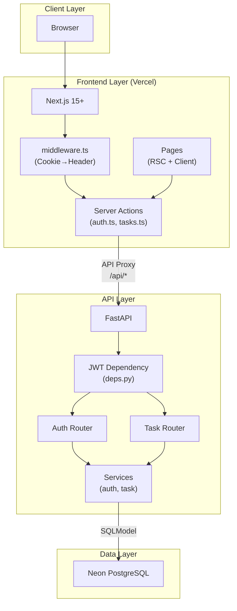
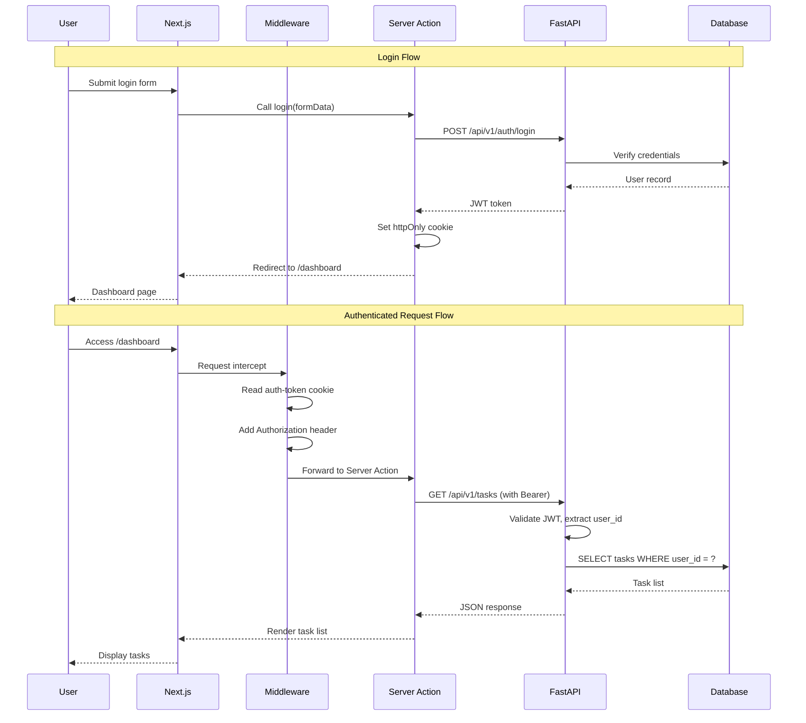
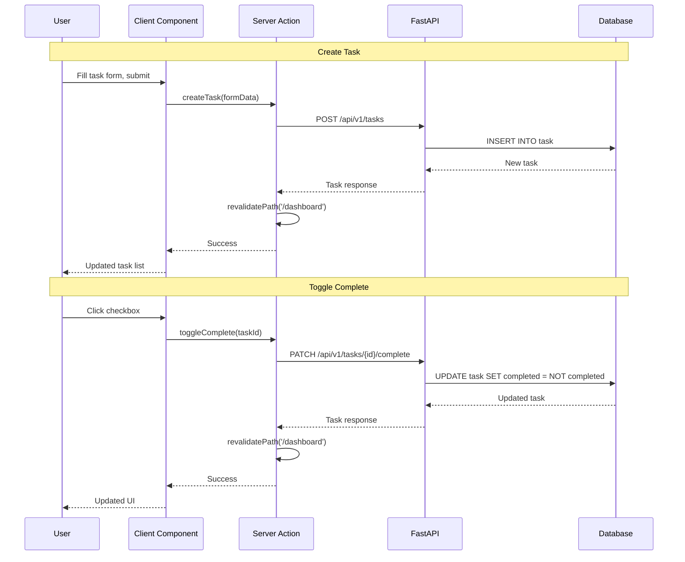
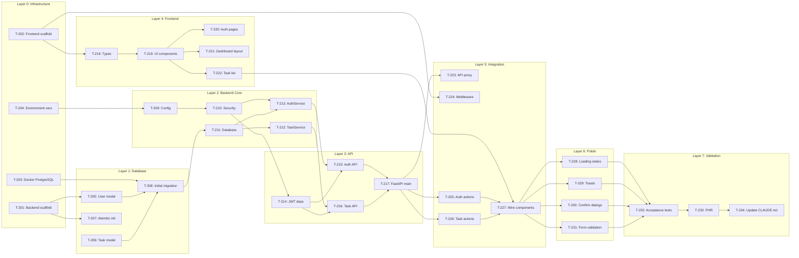

# Implementation Plan: Phase 2 Full-Stack Web Application

**Branch**: `phase-2-web-init`
**Date**: 2025-12-29
**Spec**: `phase-2-web/specs/spec.md`
**Input**: Feature specification for Full-Stack Web Application with Next.js, FastAPI, Neon PostgreSQL

---

## Summary

Evolve Phase I in-memory console Todo app into a multi-user web application with:
- **Frontend**: Next.js 15+ (App Router) with Tailwind CSS
- **Backend**: FastAPI with SQLModel ORM
- **Database**: Neon Serverless PostgreSQL
- **Authentication**: JWT-based with httpOnly cookies

Key architectural decisions (from CL-001 to CL-005):
- JWT stored in httpOnly cookie, extracted by middleware
- Server Actions with `revalidatePath` for data mutations
- Alembic for database migrations
- Layout-based authentication
- Next.js API proxy to eliminate CORS

---

## Technical Context

| Aspect | Value |
|--------|-------|
| **Language/Version** | Python 3.13+, TypeScript 5+ |
| **Primary Dependencies** | FastAPI, SQLModel, Next.js 15+, Tailwind CSS |
| **Storage** | Neon Serverless PostgreSQL |
| **Testing** | pytest (backend), Jest (frontend - optional) |
| **Target Platform** | Web (Vercel frontend, any backend host) |
| **Project Type** | Web (frontend + backend) |
| **Performance Goals** | < 500ms API response (p99), < 3s page load |
| **Constraints** | Max 1000 tasks/user, 24h JWT expiration |
| **Scale/Scope** | 100 concurrent users, 7 user stories |

---

## Constitution Check

*GATE: Verified against `.specify/memory/constitution.md`*

| Principle | Status | Evidence |
|-----------|--------|----------|
| Spec-Driven Development | PASS | Spec exists at `phase-2-web/specs/spec.md` |
| Brownfield Protocol | PASS | Evolving Phase 1 logic, not rewriting |
| Test-First Mindset | PASS | 14 acceptance criteria in spec |
| Smallest Viable Diff | PASS | Implementing only P1/P2 user stories |
| Intelligence Capture | IN PROGRESS | Will create PHR after plan |

**Technology Stack Compliance**:
| Layer | Constitution Mandate | Plan Compliance |
|-------|---------------------|-----------------|
| Frontend | Next.js 16+ (App Router) | Next.js 15+ (minor version flexibility) |
| Backend | Python FastAPI | FastAPI |
| ORM | SQLModel | SQLModel |
| Database | Neon Serverless PostgreSQL | Neon PostgreSQL |
| Authentication | Better Auth (JWT) | Custom JWT (simpler for Phase II) |

---

## Project Structure

### Documentation (this feature)

```text
phase-2-web/specs/
├── spec.md              # Feature specification
├── architecture.md      # System architecture
├── plan.md              # This file
├── research.md          # Phase 0 research findings
├── data-model.md        # Entity specifications
├── tasks.md             # Atomic implementation tasks
└── api/
    └── rest-endpoints.md # REST API contract
```

### Source Code (Phase 2)

```text
phase-2-web/
├── backend/
│   ├── app/
│   │   ├── __init__.py
│   │   ├── main.py               # FastAPI app entry point
│   │   ├── api/
│   │   │   ├── __init__.py
│   │   │   ├── deps.py           # Dependency injection (JWT auth)
│   │   │   └── v1/
│   │   │       ├── __init__.py
│   │   │       ├── router.py     # API router aggregation
│   │   │       ├── auth.py       # /auth endpoints
│   │   │       └── tasks.py      # /tasks endpoints
│   │   ├── core/
│   │   │   ├── __init__.py
│   │   │   ├── config.py         # Pydantic Settings
│   │   │   ├── security.py       # JWT + bcrypt utilities
│   │   │   └── database.py       # SQLModel engine/session
│   │   ├── models/
│   │   │   ├── __init__.py
│   │   │   ├── user.py           # User SQLModel
│   │   │   └── task.py           # Task SQLModel
│   │   └── services/
│   │       ├── __init__.py
│   │       ├── auth_service.py   # Register, login logic
│   │       └── task_service.py   # CRUD (ported from Phase 1)
│   ├── alembic/
│   │   ├── versions/
│   │   ├── env.py
│   │   └── script.py.mako
│   ├── alembic.ini
│   ├── pyproject.toml
│   ├── CLAUDE.md
│   └── tests/
│       ├── conftest.py
│       ├── test_auth.py
│       └── test_tasks.py
│
├── frontend/
│   ├── app/
│   │   ├── layout.tsx            # Root layout
│   │   ├── page.tsx              # Landing (redirect to dashboard)
│   │   ├── globals.css
│   │   ├── actions/
│   │   │   ├── auth.ts           # Server actions: login, logout, register
│   │   │   └── tasks.ts          # Server actions: CRUD
│   │   ├── (auth)/
│   │   │   ├── login/
│   │   │   │   └── page.tsx
│   │   │   └── register/
│   │   │       └── page.tsx
│   │   └── (dashboard)/
│   │       ├── layout.tsx        # Auth guard layout
│   │       └── page.tsx          # Task list dashboard
│   ├── components/
│   │   ├── ui/
│   │   │   ├── Button.tsx
│   │   │   ├── Input.tsx
│   │   │   ├── Card.tsx
│   │   │   └── Modal.tsx
│   │   ├── auth/
│   │   │   ├── LoginForm.tsx
│   │   │   └── RegisterForm.tsx
│   │   └── tasks/
│   │       ├── TaskList.tsx
│   │       ├── TaskItem.tsx
│   │       ├── TaskForm.tsx
│   │       └── DeleteConfirmDialog.tsx
│   ├── lib/
│   │   ├── api.ts                # Fetch wrapper
│   │   └── utils.ts
│   ├── types/
│   │   └── index.ts              # TypeScript interfaces
│   ├── middleware.ts             # Cookie → Header extraction
│   ├── next.config.js            # API proxy rewrites
│   ├── tailwind.config.js
│   ├── tsconfig.json
│   ├── package.json
│   └── CLAUDE.md
│
├── docker-compose.yml            # Local PostgreSQL
├── .env.example
└── CLAUDE.md
```

**Structure Decision**: Web application (frontend + backend) per constitution guidelines.

---

## Architecture Diagrams

### System Overview (Mermaid)



### Authentication Flow



### Task CRUD Flow



---

## Implementation Layers

### Layer 0: Infrastructure (No Dependencies)

| Task | Description | Verification |
|------|-------------|--------------|
| T-201 | Create `phase-2-web/backend/` project structure | `ls phase-2-web/backend/app/` shows folders |
| T-202 | Create `phase-2-web/frontend/` Next.js 15 project | `pnpm dev` starts without errors |
| T-203 | Create `docker-compose.yml` for PostgreSQL | `docker-compose up -d` succeeds |
| T-204 | Create `.env.example` with all required vars | File exists with documented vars |

### Layer 1: Database (Depends on Layer 0)

| Task | Description | Verification |
|------|-------------|--------------|
| T-205 | Create SQLModel User model | Python import succeeds |
| T-206 | Create SQLModel Task model | Python import succeeds |
| T-207 | Initialize Alembic | `alembic/` directory exists |
| T-208 | Create initial migration | `alembic upgrade head` succeeds |

### Layer 2: Backend Core (Depends on Layer 1)

| Task | Description | Verification |
|------|-------------|--------------|
| T-209 | Implement `core/config.py` | Settings load from .env |
| T-210 | Implement `core/security.py` | JWT encode/decode works |
| T-211 | Implement `core/database.py` | Session creation works |
| T-212 | Port `TaskService` from Phase 1 | Unit tests pass |
| T-213 | Implement `AuthService` | Unit tests pass |

### Layer 3: API Endpoints (Depends on Layer 2)

| Task | Description | Verification |
|------|-------------|--------------|
| T-214 | Implement JWT dependency (`deps.py`) | Returns user_id from token |
| T-215 | Implement auth endpoints | `curl` tests pass |
| T-216 | Implement task endpoints | `curl` tests pass |
| T-217 | Create FastAPI main.py | `uvicorn` starts on :8000 |

### Layer 4: Frontend Foundation (Depends on T-202)

| Task | Description | Verification |
|------|-------------|--------------|
| T-218 | Create TypeScript types | No type errors |
| T-219 | Create UI components | Storybook/visual check |
| T-220 | Create auth pages (login, register) | Pages render |
| T-221 | Create dashboard layout | Layout renders |
| T-222 | Create task list component | Component renders |

### Layer 5: Integration (Depends on Layer 3, Layer 4)

| Task | Description | Verification |
|------|-------------|--------------|
| T-223 | Configure `next.config.js` rewrites | API proxy works |
| T-224 | Implement `middleware.ts` | Auth header injected |
| T-225 | Implement auth Server Actions | Login/logout work |
| T-226 | Implement task Server Actions | CRUD works |
| T-227 | Wire components to Server Actions | E2E flow works |

### Layer 6: Polish (Depends on Layer 5)

| Task | Description | Verification |
|------|-------------|--------------|
| T-228 | Add loading states | Visual check |
| T-229 | Add toast notifications | Notifications appear |
| T-230 | Add delete confirmation dialog | Dialog works |
| T-231 | Add form validation messages | Errors display |

### Layer 7: Validation (Depends on Layer 6)

| Task | Description | Verification |
|------|-------------|--------------|
| T-232 | Run acceptance scenarios | All scenarios pass |
| T-233 | Create PHR for Phase 2 | PHR file exists |
| T-234 | Update root CLAUDE.md | Phase 2 completion noted |

---

## Dependency Graph



---

## Complexity Tracking

> No constitution violations requiring justification.

| Aspect | Constitution Limit | This Plan | Status |
|--------|-------------------|-----------|--------|
| Projects | Web = 2 (frontend + backend) | 2 | COMPLIANT |
| Dependencies | Minimal | Standard stack only | COMPLIANT |
| Custom patterns | Avoid | Standard FastAPI/Next.js patterns | COMPLIANT |

---

## Risk Mitigation

| Risk | Mitigation Strategy |
|------|---------------------|
| Deadline slippage | Focus on P1 user stories; defer P2/P3 to Phase III |
| Better Auth complexity | Use simple custom JWT implementation |
| Neon cold starts | Document in NFRs as acceptable |
| Type drift | Single source: SQLModel → Alembic → TypeScript |

---

## Acceptance Gate

Phase 2 is complete when:
- [ ] All Layer 0-7 tasks marked complete
- [ ] All P1 user stories pass acceptance scenarios
- [ ] Backend starts and serves API
- [ ] Frontend builds and deploys
- [ ] User can register, login, and manage tasks
- [ ] PHR created for Phase 2

---

## Document History

| Version | Date | Author | Changes |
|---------|------|--------|---------|
| 1.0.0 | 2025-12-29 | Lead Architect | Initial implementation plan |

---

**End of Implementation Plan**
