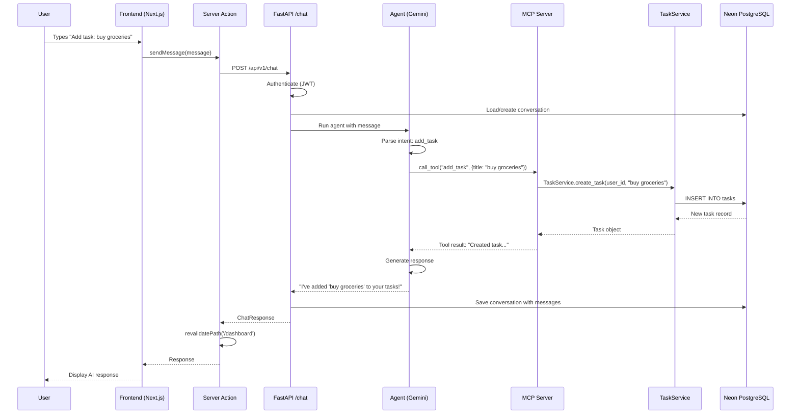
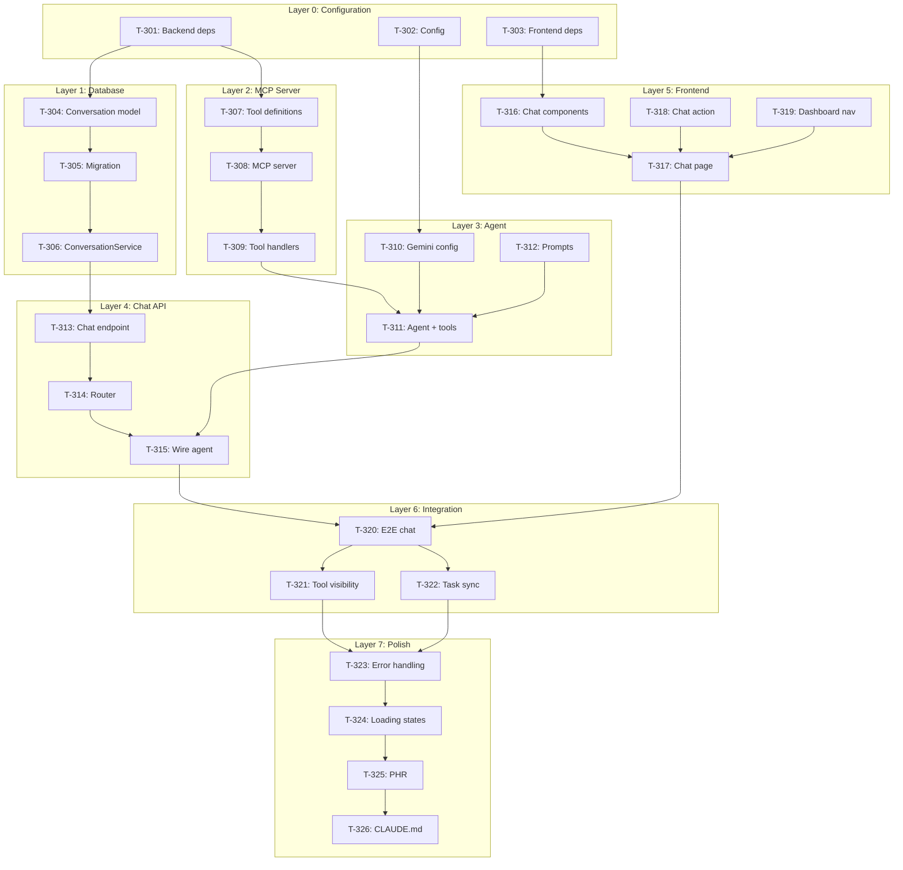

# Phase 3 Master Plan: AI Chatbot Integration

**Branch**: `phase-3-chatbot`
**Date**: 2026-01-04
**Spec**: `phase-3-chatbot/specs/master-plan.md`
**Predecessor**: Phase 2 Full-Stack Web Application (COMPLETE)

---

## Executive Summary

Phase 3 transforms the Evolution of Todo application from a traditional CRUD web app into an AI-powered conversational interface. Users will interact with their tasks through natural language, with an AI agent orchestrating MCP (Model Context Protocol) tools to perform task operations.

**Key Constraint**: Import, don't rewrite. The MCP Server MUST import existing services from `backend/app/services/` rather than duplicating logic.

---

## Constitution Compliance

| Layer | Constitution Mandate | Phase 3 Implementation |
|-------|---------------------|------------------------|
| Chat UI | OpenAI ChatKit | OpenAI ChatKit (React components) |
| AI Framework | OpenAI Agents SDK | OpenAI Agents SDK (configured for Gemini) |
| MCP Server | Official MCP SDK (Python) | `mcp` Python package |
| State | Stateless API + DB persistence | Conversation model in Neon PostgreSQL |

### Brownfield Protocol Adherence

Phase 3 extends Phase 2 by adding an AI layer on top of existing infrastructure:

```
Phase 2 Services (UNCHANGED)     Phase 3 Extensions (NEW)
--------------------------       -----------------------
app/services/task_service.py --> Imported by MCP Tools
app/services/auth_service.py --> Imported by Chat endpoint
app/models/task.py           --> Used by MCP Tools
app/models/user.py           --> Used by Chat endpoint
app/api/v1/tasks.py          --> Continues to serve REST API
```

---

## 1. MCP Server Design (Import Strategy)

### 1.1 Architecture Overview

The MCP Server is a NEW Python module that **imports and wraps** existing services without modification:

```python
# phase-3-chatbot/backend/app/mcp/tools/task_tools.py

from app.services.task_service import TaskService
from app.models.task import Task
from app.core.database import get_session

# Tool definitions wrap existing service methods
```

### 1.2 MCP Tool Definitions

| Tool Name | Service Method | Input Schema | Output Schema |
|-----------|---------------|--------------|---------------|
| `add_task` | `TaskService.create_task()` | `{user_id, title, description?}` | `{task_id, status, title}` |
| `list_tasks` | `TaskService.list_tasks()` | `{user_id, status?}` | `[{id, title, completed, ...}]` |
| `complete_task` | `TaskService.toggle_complete()` | `{user_id, task_id}` | `{task_id, status, title}` |
| `delete_task` | `TaskService.delete_task()` | `{user_id, task_id}` | `{task_id, status, title}` |
| `update_task` | `TaskService.update_task()` | `{user_id, task_id, title?, description?}` | `{task_id, status, title}` |

### 1.3 MCP Server Implementation

```python
# phase-3-chatbot/backend/app/mcp/server.py

from mcp.server import Server
from mcp.server.stdio import stdio_server
from mcp.types import Tool, TextContent

from app.mcp.tools.task_tools import (
    add_task_tool,
    list_tasks_tool,
    complete_task_tool,
    delete_task_tool,
    update_task_tool,
)

server = Server("evolution-of-todo")

@server.list_tools()
async def list_tools() -> list[Tool]:
    return [
        add_task_tool,
        list_tasks_tool,
        complete_task_tool,
        delete_task_tool,
        update_task_tool,
    ]

@server.call_tool()
async def call_tool(name: str, arguments: dict) -> list[TextContent]:
    # Route to appropriate tool handler
    handlers = {
        "add_task": handle_add_task,
        "list_tasks": handle_list_tasks,
        "complete_task": handle_complete_task,
        "delete_task": handle_delete_task,
        "update_task": handle_update_task,
    }
    return await handlers[name](arguments)
```

### 1.4 Tool Handler Pattern

Each tool handler follows this pattern:

```python
# phase-3-chatbot/backend/app/mcp/tools/task_tools.py

from uuid import UUID
from mcp.types import Tool, TextContent
from app.services.task_service import TaskService
from app.core.database import get_session

add_task_tool = Tool(
    name="add_task",
    description="Create a new task for the user",
    inputSchema={
        "type": "object",
        "properties": {
            "user_id": {"type": "string", "format": "uuid"},
            "title": {"type": "string", "minLength": 1, "maxLength": 200},
            "description": {"type": "string", "maxLength": 1000},
        },
        "required": ["user_id", "title"],
    },
)

async def handle_add_task(arguments: dict) -> list[TextContent]:
    async with get_session() as session:
        service = TaskService(session)
        task = await service.create_task(
            user_id=UUID(arguments["user_id"]),
            title=arguments["title"],
            description=arguments.get("description", ""),
        )
        await session.commit()
        return [TextContent(
            type="text",
            text=f"Created task '{task.title}' with ID {task.id}"
        )]
```

---

## 2. AI Stack Configuration

### 2.1 OpenAI Agents SDK with Google Gemini

The OpenAI Agents SDK will be configured to use Google Gemini as the underlying model. There are two architectural options:

#### Option A: OpenAI-Compatible Endpoint (RECOMMENDED)

Use Gemini through an OpenAI-compatible proxy or directly via the `openai` library with custom base URL:

```python
# phase-3-chatbot/backend/app/agent/chat_agent.py

from agents import Agent, Runner, ModelSettings
from agents.models.openai_compatible import OpenAICompatibleModel

# Configure Gemini via OpenAI-compatible interface
gemini_model = OpenAICompatibleModel(
    model="gemini-2.0-flash",
    base_url="https://generativelanguage.googleapis.com/v1beta/openai",
    api_key=settings.GEMINI_API_KEY,
)

# Create agent with MCP tools
agent = Agent(
    name="TaskAssistant",
    instructions="""You are a helpful task management assistant.
    When users ask to manage their tasks, use the available tools.
    Always confirm actions and provide helpful summaries.""",
    model=gemini_model,
    tools=[
        "add_task",
        "list_tasks",
        "complete_task",
        "delete_task",
        "update_task",
    ],
)
```

#### Option B: Custom Model Adapter

If OpenAI-compatible endpoint is unavailable, create a custom adapter:

```python
# phase-3-chatbot/backend/app/agent/gemini_adapter.py

from agents.models import Model
import google.generativeai as genai

class GeminiModelAdapter(Model):
    """Adapter to use Google Gemini with OpenAI Agents SDK."""

    def __init__(self, model_name: str = "gemini-2.0-flash"):
        genai.configure(api_key=settings.GEMINI_API_KEY)
        self.model = genai.GenerativeModel(model_name)

    async def generate(self, messages, tools=None, **kwargs):
        # Convert OpenAI message format to Gemini format
        # Handle tool calls and responses
        pass
```

### 2.2 Agent System Prompt

```python
SYSTEM_PROMPT = """You are TaskBot, an AI assistant for the Evolution of Todo application.

## Capabilities
You can help users manage their tasks through natural language. Available actions:
- Add new tasks (ask for title, optional description)
- List all tasks (can filter by status)
- Mark tasks as complete
- Update task details
- Delete tasks

## Behavior Guidelines
1. Always confirm before deleting tasks
2. Provide task summaries after operations
3. Be concise but helpful
4. If a user's request is ambiguous, ask clarifying questions
5. Report errors clearly and suggest alternatives

## Response Format
- Use bullet points for task lists
- Include task IDs when referencing specific tasks
- Celebrate completions with encouragement
"""
```

### 2.3 Conversation State (Neon DB)

New model for conversation persistence:

```python
# phase-3-chatbot/backend/app/models/conversation.py

from datetime import datetime
from uuid import UUID, uuid4
from sqlmodel import Field, SQLModel, JSON
from typing import Any

class Conversation(SQLModel, table=True):
    """Conversation history for AI chat sessions."""

    __tablename__ = "conversations"

    id: UUID = Field(default_factory=uuid4, primary_key=True)
    user_id: UUID = Field(foreign_key="users.id", index=True)
    messages: list[dict[str, Any]] = Field(default_factory=list, sa_type=JSON)
    created_at: datetime = Field(default_factory=datetime.utcnow)
    updated_at: datetime = Field(default_factory=datetime.utcnow)


class Message(SQLModel):
    """Individual message in a conversation (not a table, stored in JSON)."""

    role: str  # "user" | "assistant" | "tool"
    content: str
    tool_calls: list[dict[str, Any]] | None = None
    tool_call_id: str | None = None
    timestamp: datetime = Field(default_factory=datetime.utcnow)
```

---

## 3. Backend API Extension

### 3.1 Chat Endpoint

```python
# phase-3-chatbot/backend/app/api/v1/chat.py

from fastapi import APIRouter, Depends, HTTPException
from pydantic import BaseModel
from uuid import UUID
from typing import Optional

from app.api.deps import get_current_user
from app.agent.chat_agent import run_agent
from app.models.conversation import Conversation
from app.models.user import User

router = APIRouter(prefix="/chat", tags=["Chat"])

class ChatRequest(BaseModel):
    conversation_id: Optional[UUID] = None
    message: str

class ToolCall(BaseModel):
    tool_name: str
    arguments: dict
    result: str

class ChatResponse(BaseModel):
    conversation_id: UUID
    response: str
    tool_calls: list[ToolCall] = []

@router.post("", response_model=ChatResponse)
async def chat(
    request: ChatRequest,
    current_user: User = Depends(get_current_user),
):
    """Process a chat message and return AI response."""

    # Load or create conversation
    conversation = await get_or_create_conversation(
        user_id=current_user.id,
        conversation_id=request.conversation_id,
    )

    # Run agent with user context
    result = await run_agent(
        user_id=current_user.id,
        conversation=conversation,
        message=request.message,
    )

    # Persist updated conversation
    await save_conversation(conversation)

    return ChatResponse(
        conversation_id=conversation.id,
        response=result.response,
        tool_calls=result.tool_calls,
    )
```

### 3.2 Router Integration

```python
# phase-3-chatbot/backend/app/api/v1/router.py (MODIFIED)

from fastapi import APIRouter
from app.api.v1 import auth, tasks, chat  # ADD chat import

router = APIRouter(prefix="/api/v1")

router.include_router(auth.router)
router.include_router(tasks.router)
router.include_router(chat.router)  # ADD chat router
```

---

## 4. Frontend Integration

### 4.1 Chat Page Structure

```
frontend/
├── app/
│   └── dashboard/
│       ├── page.tsx              # Existing task list
│       └── chat/                 # NEW: Chat interface
│           └── page.tsx
├── components/
│   ├── chat/                     # NEW: Chat components
│   │   ├── ChatContainer.tsx     # Main chat wrapper
│   │   ├── MessageList.tsx       # Message history display
│   │   ├── MessageInput.tsx      # User input field
│   │   ├── Message.tsx           # Individual message
│   │   └── ToolCallIndicator.tsx # Shows when AI uses tools
│   └── ...
└── actions/
    └── chat.ts                   # NEW: Chat server action
```

### 4.2 Chat Components with OpenAI ChatKit

```typescript
// phase-3-chatbot/frontend/components/chat/ChatContainer.tsx

'use client';

import { useChat } from '@assistant-ui/react';  // OpenAI ChatKit
import { MessageList } from './MessageList';
import { MessageInput } from './MessageInput';

export function ChatContainer() {
  const { messages, input, handleInputChange, handleSubmit, isLoading } = useChat({
    api: '/api/chat',
    initialMessages: [],
  });

  return (
    <div className="flex flex-col h-full">
      <MessageList messages={messages} isLoading={isLoading} />
      <MessageInput
        value={input}
        onChange={handleInputChange}
        onSubmit={handleSubmit}
        disabled={isLoading}
      />
    </div>
  );
}
```

### 4.3 Chat Server Action

```typescript
// phase-3-chatbot/frontend/app/actions/chat.ts

'use server';

import { cookies } from 'next/headers';
import { revalidatePath } from 'next/cache';

interface ChatResponse {
  conversation_id: string;
  response: string;
  tool_calls: Array<{
    tool_name: string;
    arguments: Record<string, unknown>;
    result: string;
  }>;
}

export async function sendMessage(
  message: string,
  conversationId?: string
): Promise<ChatResponse> {
  const cookieStore = await cookies();
  const token = cookieStore.get('auth-token')?.value;

  if (!token) {
    throw new Error('Not authenticated');
  }

  const response = await fetch(`${process.env.BACKEND_URL}/api/v1/chat`, {
    method: 'POST',
    headers: {
      'Content-Type': 'application/json',
      'Authorization': `Bearer ${token}`,
    },
    body: JSON.stringify({
      conversation_id: conversationId,
      message,
    }),
  });

  if (!response.ok) {
    throw new Error('Chat request failed');
  }

  const data = await response.json();

  // Revalidate tasks if any task-modifying tools were called
  const taskTools = ['add_task', 'complete_task', 'delete_task', 'update_task'];
  const usedTaskTool = data.tool_calls?.some(
    (tc: { tool_name: string }) => taskTools.includes(tc.tool_name)
  );

  if (usedTaskTool) {
    revalidatePath('/dashboard');
  }

  return data;
}
```

### 4.4 Dashboard Navigation Update

```typescript
// phase-3-chatbot/frontend/app/dashboard/layout.tsx (MODIFIED)

import Link from 'next/link';

export default function DashboardLayout({
  children,
}: {
  children: React.ReactNode;
}) {
  return (
    <div className="flex h-screen">
      <nav className="w-64 bg-gray-100 p-4">
        <ul className="space-y-2">
          <li>
            <Link href="/dashboard" className="...">
              Tasks
            </Link>
          </li>
          <li>
            <Link href="/dashboard/chat" className="...">
              Chat Assistant
            </Link>
          </li>
        </ul>
      </nav>
      <main className="flex-1">{children}</main>
    </div>
  );
}
```

---

## 5. System Flow Diagram

```
┌──────────────────────────────────────────────────────────────────────────────┐
│                              USER INTERACTION                                  │
└──────────────────────────────────────────────────────────────────────────────┘
                                      │
                                      ▼
┌──────────────────────────────────────────────────────────────────────────────┐
│  FRONTEND (Next.js)                                                           │
│  ┌─────────────────────┐                                                      │
│  │   Chat Page         │                                                      │
│  │   /dashboard/chat   │                                                      │
│  └──────────┬──────────┘                                                      │
│             │ User types: "Add a task to buy groceries"                       │
│             ▼                                                                 │
│  ┌─────────────────────┐                                                      │
│  │   Server Action     │                                                      │
│  │   sendMessage()     │                                                      │
│  └──────────┬──────────┘                                                      │
└─────────────│────────────────────────────────────────────────────────────────┘
              │ POST /api/v1/chat { message: "Add a task to buy groceries" }
              ▼
┌──────────────────────────────────────────────────────────────────────────────┐
│  BACKEND (FastAPI)                                                            │
│  ┌─────────────────────┐                                                      │
│  │   Chat Endpoint     │                                                      │
│  │   /api/v1/chat      │                                                      │
│  └──────────┬──────────┘                                                      │
│             │ Authenticate user, load conversation                            │
│             ▼                                                                 │
│  ┌─────────────────────┐                                                      │
│  │   Agent Runner      │◄────── OpenAI Agents SDK                             │
│  │   (Gemini Model)    │        configured with Gemini                        │
│  └──────────┬──────────┘                                                      │
│             │ Agent decides to call add_task tool                             │
│             ▼                                                                 │
│  ┌─────────────────────┐                                                      │
│  │   MCP Server        │                                                      │
│  │   Tool Router       │                                                      │
│  └──────────┬──────────┘                                                      │
│             │ Route to add_task handler                                       │
│             ▼                                                                 │
│  ┌─────────────────────┐     ┌─────────────────────┐                          │
│  │   Task Tools        │────►│   TaskService       │ (IMPORTED from Phase 2)  │
│  │   handle_add_task() │     │   create_task()     │                          │
│  └─────────────────────┘     └──────────┬──────────┘                          │
│                                         │                                     │
└─────────────────────────────────────────│─────────────────────────────────────┘
                                          │ INSERT INTO tasks
                                          ▼
┌──────────────────────────────────────────────────────────────────────────────┐
│  DATABASE (Neon PostgreSQL)                                                   │
│  ┌─────────────────────┐     ┌─────────────────────┐                          │
│  │   tasks             │     │   conversations     │                          │
│  │   (existing)        │     │   (NEW in Phase 3)  │                          │
│  └─────────────────────┘     └─────────────────────┘                          │
└──────────────────────────────────────────────────────────────────────────────┘
```

### Sequence Diagram



---

## 6. File Structure Plan

```
phase-3-chatbot/
├── backend/
│   ├── app/
│   │   ├── __init__.py
│   │   ├── main.py                      # FastAPI entry (ADD MCP mount)
│   │   │
│   │   ├── mcp/                         # NEW: MCP Server Module
│   │   │   ├── __init__.py
│   │   │   ├── server.py                # MCP Server entrypoint
│   │   │   └── tools/
│   │   │       ├── __init__.py
│   │   │       └── task_tools.py        # 5 tool definitions
│   │   │
│   │   ├── agent/                       # NEW: Agent Module
│   │   │   ├── __init__.py
│   │   │   ├── chat_agent.py            # OpenAI Agents SDK + Gemini
│   │   │   ├── prompts.py               # System prompts
│   │   │   └── gemini_adapter.py        # (Optional) Custom adapter
│   │   │
│   │   ├── api/
│   │   │   ├── deps.py                  # Existing (no changes)
│   │   │   └── v1/
│   │   │       ├── __init__.py
│   │   │       ├── router.py            # MODIFY: Add chat router
│   │   │       ├── auth.py              # Existing (no changes)
│   │   │       ├── tasks.py             # Existing (no changes)
│   │   │       └── chat.py              # NEW: Chat endpoint
│   │   │
│   │   ├── core/
│   │   │   ├── config.py                # MODIFY: Add GEMINI_API_KEY
│   │   │   ├── database.py              # Existing (no changes)
│   │   │   └── security.py              # Existing (no changes)
│   │   │
│   │   ├── models/
│   │   │   ├── __init__.py              # MODIFY: Export Conversation
│   │   │   ├── user.py                  # Existing (no changes)
│   │   │   ├── task.py                  # Existing (no changes)
│   │   │   └── conversation.py          # NEW: Conversation model
│   │   │
│   │   └── services/
│   │       ├── __init__.py
│   │       ├── auth_service.py          # Existing (no changes)
│   │       ├── task_service.py          # Existing (IMPORTED by MCP)
│   │       └── conversation_service.py  # NEW: Conversation CRUD
│   │
│   ├── alembic/
│   │   └── versions/
│   │       └── 20260104_001_add_conversations.py  # NEW: Migration
│   │
│   └── pyproject.toml                   # MODIFY: Add new deps
│
├── frontend/
│   ├── app/
│   │   ├── dashboard/
│   │   │   ├── layout.tsx               # MODIFY: Add nav
│   │   │   ├── page.tsx                 # Existing task list
│   │   │   └── chat/                    # NEW: Chat page
│   │   │       └── page.tsx
│   │   │
│   │   └── actions/
│   │       ├── auth.ts                  # Existing (no changes)
│   │       ├── tasks.ts                 # Existing (no changes)
│   │       └── chat.ts                  # NEW: Chat action
│   │
│   ├── components/
│   │   ├── chat/                        # NEW: Chat components
│   │   │   ├── ChatContainer.tsx
│   │   │   ├── MessageList.tsx
│   │   │   ├── MessageInput.tsx
│   │   │   ├── Message.tsx
│   │   │   └── ToolCallIndicator.tsx
│   │   │
│   │   ├── tasks/                       # Existing (no changes)
│   │   ├── auth/                        # Existing (no changes)
│   │   └── ui/                          # Existing (no changes)
│   │
│   └── package.json                     # MODIFY: Add @assistant-ui/react
│
├── specs/
│   ├── master-plan.md                   # THIS FILE
│   ├── tasks.md                         # MODIFY: Add Phase 3 tasks
│   └── api/
│       └── chat-endpoint.md             # NEW: Chat API spec
│
└── .env.example                         # MODIFY: Add GEMINI_API_KEY
```

---

## 7. Implementation Layers

### Layer 0: Configuration & Dependencies

| Task ID | Description | Files | Verification |
|---------|-------------|-------|--------------|
| T-301 | Add Phase 3 dependencies to pyproject.toml | `backend/pyproject.toml` | `uv sync` succeeds |
| T-302 | Add GEMINI_API_KEY to config | `backend/app/core/config.py`, `.env.example` | Settings load successfully |
| T-303 | Add frontend chat dependencies | `frontend/package.json` | `pnpm install` succeeds |

### Layer 1: Database Extension

| Task ID | Description | Files | Verification |
|---------|-------------|-------|--------------|
| T-304 | Create Conversation model | `backend/app/models/conversation.py` | Python import succeeds |
| T-305 | Create Alembic migration | `backend/alembic/versions/...` | `alembic upgrade head` succeeds |
| T-306 | Create ConversationService | `backend/app/services/conversation_service.py` | Unit tests pass |

### Layer 2: MCP Server

| Task ID | Description | Files | Verification |
|---------|-------------|-------|--------------|
| T-307 | Create MCP tool definitions | `backend/app/mcp/tools/task_tools.py` | Tools load without error |
| T-308 | Create MCP server | `backend/app/mcp/server.py` | Server starts, tools listed |
| T-309 | Write MCP tool handlers | `backend/app/mcp/tools/task_tools.py` | Each tool executes successfully |

### Layer 3: Agent Integration

| Task ID | Description | Files | Verification |
|---------|-------------|-------|--------------|
| T-310 | Create Gemini model configuration | `backend/app/agent/chat_agent.py` | Model responds to test prompt |
| T-311 | Create agent with MCP tools | `backend/app/agent/chat_agent.py` | Agent can call tools |
| T-312 | Create system prompts | `backend/app/agent/prompts.py` | Prompts load correctly |

### Layer 4: Chat API

| Task ID | Description | Files | Verification |
|---------|-------------|-------|--------------|
| T-313 | Create chat endpoint | `backend/app/api/v1/chat.py` | Endpoint responds |
| T-314 | Integrate chat router | `backend/app/api/v1/router.py` | Chat route accessible |
| T-315 | Wire agent to endpoint | `backend/app/api/v1/chat.py` | Full chat flow works |

### Layer 5: Frontend Chat UI

| Task ID | Description | Files | Verification |
|---------|-------------|-------|--------------|
| T-316 | Create chat components | `frontend/components/chat/*.tsx` | Components render |
| T-317 | Create chat page | `frontend/app/dashboard/chat/page.tsx` | Page accessible |
| T-318 | Create chat server action | `frontend/app/actions/chat.ts` | Action executes |
| T-319 | Update dashboard layout | `frontend/app/dashboard/layout.tsx` | Navigation works |

### Layer 6: Integration & Testing

| Task ID | Description | Files | Verification |
|---------|-------------|-------|--------------|
| T-320 | End-to-end chat flow | - | User can chat, tasks created |
| T-321 | Tool call visibility | - | UI shows tool calls |
| T-322 | Task list sync | - | Task list updates after chat |

### Layer 7: Polish & Documentation

| Task ID | Description | Files | Verification |
|---------|-------------|-------|--------------|
| T-323 | Error handling in chat | All chat files | Errors displayed gracefully |
| T-324 | Loading states | Frontend components | Loading indicators work |
| T-325 | Create PHR for Phase 3 | `history/prompts/phase-3/...` | PHR exists |
| T-326 | Update CLAUDE.md | `CLAUDE.md` | Phase 3 documented |

---

## 8. Dependency Graph



---

## 9. New Dependencies

### Backend (pyproject.toml additions)

```toml
[project]
dependencies = [
    # ... existing dependencies ...

    # Phase 3: AI Chatbot
    "mcp>=1.0.0",                    # MCP Server SDK
    "openai-agents>=0.1.0",          # OpenAI Agents SDK
    "google-generativeai>=0.8.0",    # Gemini Python SDK (fallback)
]
```

### Frontend (package.json additions)

```json
{
  "dependencies": {
    "@assistant-ui/react": "^0.5.0"
  }
}
```

---

## 10. Environment Variables

```bash
# .env.example (additions for Phase 3)

# AI Configuration
GEMINI_API_KEY=your_gemini_api_key_here
GEMINI_MODEL=gemini-2.0-flash

# Agent Settings
AGENT_MAX_TURNS=10
AGENT_TIMEOUT_SECONDS=30
```

---

## 11. Acceptance Criteria

### Phase 3 is complete when:

1. **MCP Server**
   - [ ] All 5 tools defined and working
   - [ ] Tools import from existing TaskService
   - [ ] No code duplication with Phase 2 services

2. **Agent Integration**
   - [ ] Agent responds to natural language
   - [ ] Agent correctly selects and calls MCP tools
   - [ ] Gemini model successfully processes requests

3. **Chat Endpoint**
   - [ ] POST /api/v1/chat accepts messages
   - [ ] Conversation state persists in database
   - [ ] Authentication required and enforced

4. **Frontend**
   - [ ] Chat page accessible at /dashboard/chat
   - [ ] Messages display correctly
   - [ ] Tool calls visible to user
   - [ ] Task list updates after chat operations

5. **Documentation**
   - [ ] PHR created for Phase 3
   - [ ] CLAUDE.md updated with Phase 3 completion

---

## 12. Risk Mitigation

| Risk | Probability | Impact | Mitigation |
|------|-------------|--------|------------|
| OpenAI Agents SDK incompatible with Gemini | Medium | High | Implement Option B (custom adapter) |
| MCP SDK breaking changes | Low | Medium | Pin version in pyproject.toml |
| Gemini rate limits | Medium | Medium | Implement retry logic with backoff |
| Frontend ChatKit complexity | Low | Low | Use simpler custom chat UI if needed |
| Conversation state bloat | Medium | Low | Add message limit per conversation |

---

## 13. ADR Candidates

The following decisions may warrant Architecture Decision Records:

| ID | Title | Trigger |
|----|-------|---------|
| ADR-008 | Gemini via OpenAI-Compatible Interface | If Option A chosen |
| ADR-009 | MCP Server as Embedded Module | Decided: Not standalone process |
| ADR-010 | Conversation Storage Strategy | JSON array vs. separate messages table |

---

## Document History

| Version | Date | Author | Changes |
|---------|------|--------|---------|
| 1.0.0 | 2026-01-04 | @modular-ai-architect | Initial Phase 3 Master Plan |

---

**End of Phase 3 Master Plan**
